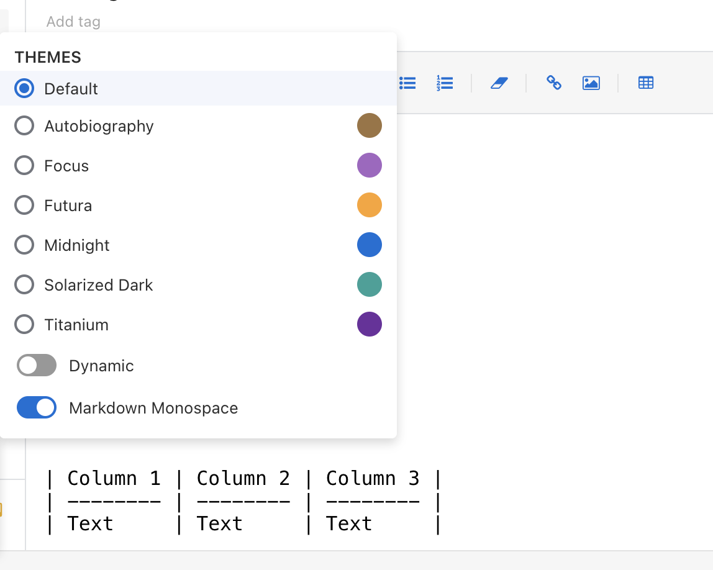
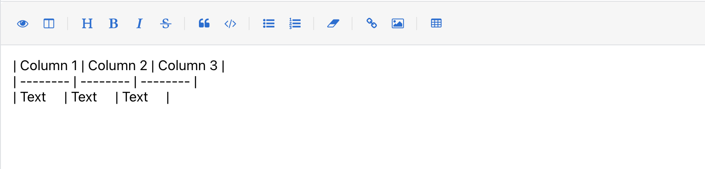
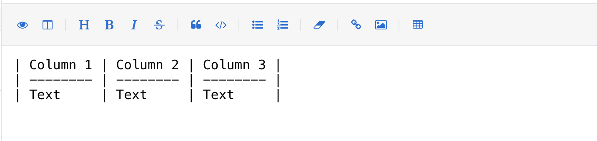

# Monospace font for Standard Notes markdown editors

(This theme used to live in https://github.com/DanielNetoP/markdown-monospace)

This theme is toggable on top of other themes, it simply adds the monospace font family to the editors.

Instead, it adds a Monospace font to use in the following editors:
- Basic Markdown
- Minimal Markdown
- Markdown

## Preview
**Toggle theme:**

**Before:**

**After:**

